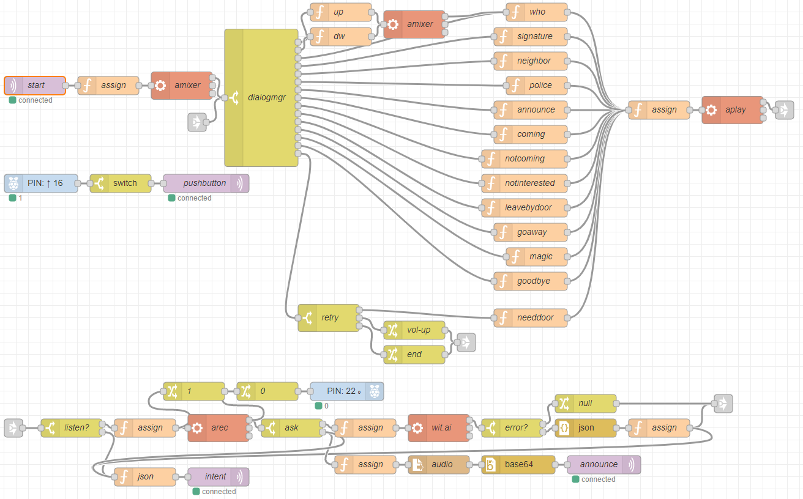
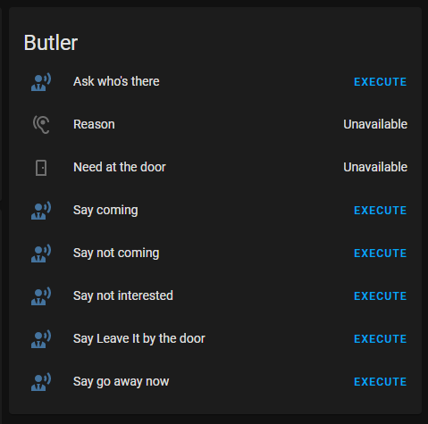

# Door Butler
Interactive voice assistant that helps identifies who is at the door and route visitors 
## Goals
Wish list of capabilities:
* Smart voice screening (done) 
* Dialog management (done) 
* Led status indicator (done) 
* Prerecorded answers (done) 
* MQTT (done) 
* Integration with Home-assistant (done) 
* Presence detection 
* Video streaming 
* Two-way audio 
## Hardware
* Raspberry Pi Zero W 
* Google AIY voice hat 
* PlayStation Eye  
## Software
* [Node-red](https://nodered.org/) to run linux system commands:
  * amixer to adjust volume
  * aplay to play pre-recorded messages
  * arecord to record short utterances
* Node-red also serves as dialog manager and mqtt client
* [WIT.AI](https://wit.ai/) to process utterances and recognize intents

## Installation
1. Install [Raspberry Pi OS](https://www.raspberrypi.org/downloads/) to an SD card
2. Install [Node-Red](https://nodered.org/docs/getting-started/raspberrypi)
3. Navigate to http://hostname:1880 and import the [DoorButler flow](https://github.com/RABCbot/door-butler/blob/master/node-red/butler-flow.json)
4. Create an [app](https://wit.ai/docs/quickstart) with wit.ai
## Home-assistant
()
